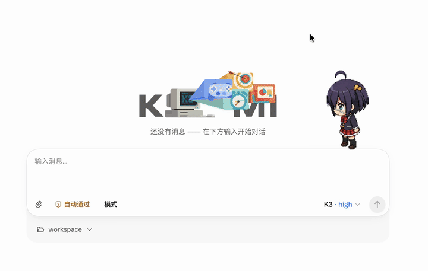
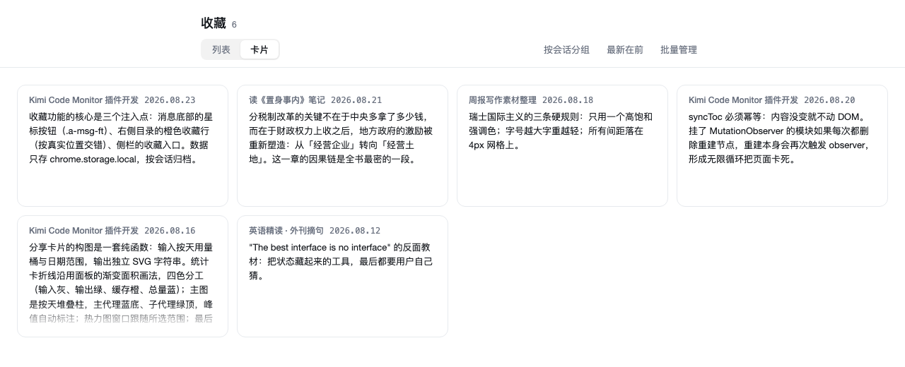

# Kimi Code Monitor

<p align="center"><strong><a href="README.md">简体中文</a> | English</strong></p>

> **Contents**
> [1. Features](#1-features): [Pet](#universal-codex-desktop-pet) · [Usage Analytics](#usage-analytics) · [Bookmarks](#ai-reply-bookmarks) · [Share Card](#usage-share-card) · [Mascot](#a-mascot-that-reflects-state) · [Custom Panel](#modular-customizable-panel) · [Auto-Archive](#auto-archive-inactive-chats-experimental) · [Titles](#session-title-auto-generation-official-capability) · [More](#more)
>
> [**2. Installation & Authorization**](#2-installation--authorization): [desktop client](#2-installation--authorization) · [Chrome extension](#2-installation--authorization)
>
> [3. Data & Privacy](#3-data--privacy)
>
> [4. Technical Implementation](#4-technical-implementation)


> **Desktop client support (macOS / Windows)**: the same panel can be patched into the Kimi Code desktop client's session sidebar — no client code changes, automatic backup, fully reversible uninstall. Zero installation prerequisites: the client itself is all you need; no Node.js or any other dependency.
>
> Compared with the browser extension, the client edition does **not** yet support: the popup suite (custom-range usage charts / 140-day heatmap / data export / share cards / pet gallery management), AI reply bookmarks, auto-archiving, and quota-alert desktop notifications. External accounts, on the other hand, are easier: balances follow the providers configured in the client automatically — no manual key entry.
>
> The recommended path installs an ops skill first: paste the prompt below into Kimi inside the desktop client; it will install the skill, then follow the skill's guidance to set up the panel:
>
> ```text
> 请根据 https://raw.githubusercontent.com/bfjnbvf/kimi-code-monitor/main/docs/SKILL-INSTALL.md ，安装 kimi-code-monitor 技能；装好启用后，按技能指示帮助我安装 Kimi Code 客户端面板。
> ```
>
> Uninstall and daily maintenance: [docs/DESKTOP-PATCH.md](docs/DESKTOP-PATCH.md). Self-checks and provider balance troubleshooting are handled by the ops skill.


A sidebar monitor extension for Kimi Code Web — the same panel also runs inside the Kimi Code desktop client (macOS / Windows, installed as a patch). A mascot that mirrors the agent's working state, a desktop pet compatible with Codex pet galleries, a complete usage analytics & sharing suite, and an AI-reply bookmark manager — all running locally, nothing uploaded.


## 1. Features

### Universal Codex Desktop Pet

Adopt a pixel pet on the page. It follows your working rhythm: heads down while your prompt is being processed, signals you when the answer is ready, droops on errors or disconnects, and idles quietly otherwise.



- Fully compatible with the Codex official pet asset format: open the popup, copy an install command from a pet gallery ([codexpet.top](https://codexpet.top/zh), [petdex.dev](https://petdex.dev)), paste, install — done
- Keep multiple pets and switch with one click; hover to greet, drag to park it anywhere, and it turns to watch your cursor (v2 assets); scalable from 50% to 150%

### Usage Analytics

- **Quota bars**: 5-hour and weekly quota with reset countdowns and a pace reference line — the position you'd be at with perfectly even consumption; past it means you're burning fast
- **Daily usage**: connect your local Kimi CLI for per-day token stats (24h / 7d / 30d), main/sub agents stacked
- **Sparklines**: pull a stat module to full width for per-turn trend curves of the current session, hover for exact values
- **Full popup edition**: daily usage chart with custom date ranges, a 140-day activity heatmap, and data export (no conversation content)
- **Quota alerts**: desktop notifications at 80% and 95% of the 5h / weekly quota


### AI Reply Bookmarks

See an answer worth keeping? Click the star in the action row below it.

- Bookmarked replies appear in the right-side message outline as **orange rows**, interleaved at their true positions — click to jump back
- A sidebar "Bookmark" entry opens a full-page bookmark manager: **list / card views**, group-by-session and time sorting, batch management (select all / delete selected)
- Open any item for a detail card: your previous question + the reply fully rendered in Markdown + a jump-to-original button
- Cross-session jumps supported; all bookmark data stays local
- A master switch lives in the popup's "Extensions" card (on by default); turning it off hides the stars and the bookmark page while keeping the data



### Usage Share Card

Click "Create share card" in the popup's usage section to render a 1080×1350 card for the selected date range: four stat cards (input / output / cache hit / total, each with a gradient sparkline and key date labels), a daily stacked bar chart with axis guides, an activity heatmap, and a range summary (active days / daily average / main vs sub agents / peak day).

Download a 2x high-res PNG or copy it straight to the clipboard.


### A Mascot That Reflects State

The panel hosts Kimi's official blue ball (the same animation as kimi.com's chat page). It breathes and shows the time when idle; switches to a loading animation and counts up while a turn runs (tool calls don't interrupt); celebrates with confetti when the answer finishes; and has dedicated moves for rate limiting, subagent work, and reconnecting. Click it for a random trick.

The status text beside it distinguishes "Thinking" (model generating) from "Executing" (tool calls), colored by state; the data slot cycles through six metrics: 24h usage / input / output / cache hit / speed / balance.

### Modular Customizable Panel

Every info block is an independent module — combine them freely. Module sizes are adjustable too, and different sizes reveal different content: half width keeps the key number, full width expands into sparklines, bar charts, and more.

- **Long-press** to enter edit mode; drag modules across three zones: hidden / full-mode only / kept in Mini
- Drag to reorder within a zone, mixing half and full widths like tiles
- Each module's ≡ menu holds its own settings


### Auto-Archive Inactive Chats (Experimental)

Moves inactive sessions to the sidebar's "Done" tab, keeping the "Open" list clean. Three independently adjustable rules, each with its own enable checkbox and hover explanation:

- **Single-day**: sessions used within 2 days of creation (one-off tasks) — archived after **3** idle days by default
- **Multi-day**: sessions used across more than 2 days (revisited every few days) — archived after **14** idle days by default
- **Any session**: regardless of span, archived after **30** idle days (fallback)

The first run lists matching sessions for one-click confirmation and unlocks auto-archiving; afterwards it runs every 24 hours in the background with a desktop notification. Sessions that are busy, awaiting interaction, child sessions, under 24 hours old, or empty are never touched. Archiving is fully reversible via Kimi Web's archived-sessions manager. Classification is computed locally from list metadata (created/updated times) only — conversation content is never read. Enabling the feature turns on Kimi Web's experimental "Multi-tab sidebar".

### Session Title Auto-Generation (official capability)

Session titles are auto-generated by the official Kimi CLI experiment "AI session titles": the title is generated right after the first turn completes, and the right-click "Generate title" action is available anytime. Manually renamed titles are never overwritten.

To enable: set the environment variable `KIMI_CODE_EXPERIMENTAL_FLAG=1` where you launch kimi (e.g. in ~/.zshrc, then restart the terminal) and confirm auto_session_title is enabled via /experiments. The same guide lives in the ⓘ tooltip of the popup's "Extensions" card.

### More

- Booster-pack balance display, click through to the top-up page (or the console)
- Optional sidebar tidy: hides the sidebar logo and moves New Chat up in line with the collapse button

## 2. Installation & Authorization

<details>
<summary>Desktop client Skill edition (macOS / Windows desktop client, recommended)</summary>

The only prerequisite is the Kimi Code desktop client itself. The installer borrows the client's built-in runtime — **no Node.js required, and nothing is written outside the client's own resource directory**.

**Option 1 (recommended): let Kimi install it**

Paste the prompt below into Kimi inside the desktop client; it will install the skill, then follow the skill's guidance to set up the panel:

```text
请根据 https://raw.githubusercontent.com/bfjnbvf/kimi-code-monitor/main/docs/SKILL-INSTALL.md ，安装 kimi-code-monitor 技能；装好启用后，按技能指示帮助我安装 Kimi Code 客户端面板。
```

**Option 2: manual install**

1. Download `kcm-desktop-patch.zip` from [Releases](https://github.com/bfjnbvf/kimi-code-monitor/releases) and extract it
2. On macOS run `bash install.sh` in a terminal; on Windows just double-click `install.cmd` (or run it in cmd). If the client is not in its default location, append `--app "<client directory>"`
3. Reload the client (macOS `Cmd+R`, Windows `Ctrl+R`) — the panel appears at the bottom of the session sidebar

Installation is idempotent and can be re-run any time; `--uninstall` removes everything cleanly (original file restored). A major client update wipes the panel files — simply re-run the installer; usage history is re-scanned automatically and data accumulated in the client's own storage is unaffected.

Uninstall and daily maintenance: [docs/DESKTOP-PATCH.md](docs/DESKTOP-PATCH.md). Self-checks and provider balance troubleshooting are handled by the ops skill.

</details>

<details>
<summary>Pro extension edition (Chrome / Edge browser extension)</summary>

Requires Chrome 120 or newer.

**Option 1 (recommended): download the prebuilt zip**

Grab the latest `kimi-code-monitor-v*.zip` from [Releases](https://github.com/bfjnbvf/kimi-code-monitor/releases), unzip, enable Developer Mode at `chrome://extensions`, and load the unzipped folder.

> Note: GitHub's "Code → Download ZIP" gives you the **source package** (`kimi-code-monitor-main`) without the `dist/` build output — loading it directly fails with "Could not load JavaScript 'dist/content.js'". Use the Releases zip unless you want to build it yourself.

**Option 2: build from source**

0. Build first: `npm install && npm run build` (bundles `src/` into `dist/`; re-run after any source change)
1. Enable Developer Mode at `chrome://extensions` and load this folder (or the unzipped release)
2. Open the local page started by `kimi web`
3. A walkthrough shows on first load; complete the one-time device authorization when the panel prompts
4. For 24h / 7d / 30d long-term stats, click "Connect local CLI" in the usage module or the popup and choose the sessions directory: `~/.kimi-code/sessions` on macOS / Linux, `%USERPROFILE%\.kimi-code\sessions` on Windows

> `.kimi-code` is a hidden folder. In the macOS picker press `⌘⇧.` to show hidden folders; on Linux usually `Ctrl+H`; on Windows press `Ctrl+L` and paste the path. If you configured `KIMI_CODE_HOME`, choose its `sessions` subdirectory.

> After reloading the extension at `chrome://extensions`, refresh the Kimi Code Web page once for the panel to come back.

The extension uses its own OAuth token and never reads or writes Kimi Code CLI credentials. The CLI directory grant is only used for optional long-term usage stats.

</details>

## 3. Data & Privacy

<details>
<summary>Expand</summary>

- WebSocket session history is not persisted by default; input, output, cache, speed, and sparklines only hold current-page data
- Without the local CLI connection, 24h / 7d / 30d long-term stats stay locked; all real-time features work regardless
- With the CLI connected, only `sessions/**/agents/*/wire.jsonl` is read, extracting just `usage.record` usage entries and model names from `config.update`; when the `~/.kimi-code` root directory is granted, the `[secondary_model]` model name in `config.toml` is also read. Conversation text, tool arguments, and answers are never stored or uploaded
- Auto-tidy only reads session list metadata (created/updated times, titles, activity status); classification and archiving are explicit API calls. Conversation content is never read
- Input = uncached input + cache read + cache creation; cache hit rate = cache read ÷ total input
- The CLI stats cache keeps only file read offsets and per-day numbers for the last 90 days; disconnect and clear anytime, then regenerate
- Bookmarks live only in local extension storage (turn id + text excerpt + rendered fragment; nothing uploaded); deleting bookmarks or uninstalling the extension wipes them
- First connect shows real read progress; afterwards only new records are read incrementally, with auto-refresh rate-limited
- Quota and cache hit rate are shown with one decimal; values below 100% are never rounded up to 100.0% early
- The background message router validates senders: extension pages are fully trusted; content scripts must come from loopback or a granted site and may only use the message types the panel needs (`src/background/sender-guard.js`)
- The Rive animation assets are exposed to all http(s) pages via `web_accessible_resources` (dynamically granted sites cannot be enumerated statically in the manifest), so a web page can in theory probe whether this extension is installed; no other resource or interface is exposed to arbitrary pages

</details>

## 4. Technical Implementation

The panel is a content script injected into the kimi web page: it reconstructs session state from the page's WebSocket event stream, mounts its DOM inside the sidebar, and keeps everything in memory — nothing is uploaded. Quota and authorization go through the extension background's OAuth channel; long-term usage stats come from incrementally reading local CLI session files after an explicit directory grant.

The desktop client (patch edition) shares the same panel body and rendering layer from `src/content/`, but its data path is entirely different — it bypasses the extension background and talks to the client directly: `loader.js` injects into the client's page (a script tag carrying the payload content hash to bust caching; the original `index.html` is backed up and restored byte-for-byte on uninstall); the panel's `direct.js` connects straight to the local kap-server — WebSocket event stream for session state, REST polling for quota and booster balance; external accounts read the providers configured in the client itself (the key is used once in memory only, never persisted) and query each vendor's balance endpoint directly, refreshing every 60 seconds and keeping the last successful value (with its age) on failure; long-term stats are pre-filled by a full scan of `~/.kimi-code/sessions` at install time (per-day / per-hour / per-session agent × model breakdown) and keep accumulating in-page. Zero-prerequisite installation works via two thin "launcher" shells (`install.sh` / `install.cmd`) that prefer the client's built-in Node runtime (Electron's `ELECTRON_RUN_AS_NODE`), falling back to a system Node; the install logic itself lives only in `install.mjs`, shared across macOS and Windows.

<details>
<summary>Expand</summary>

Source lives in `src/` (ES modules). `npm run build` bundles with esbuild into `dist/` (four bundles: content/background/popup/panel-app); the manifest and popup.html only reference `dist/` output. `npm test` builds then runs the full test suite (including release guards); `npm run lint` checks references (no-undef etc.).

Four runtime surfaces, each with its own directory; shared modules sit at the `src/` root:

- `src/content.js` + `src/content/`: the in-page panel — `content.js` (orchestration & lifecycle), `panel-state.js` (shared state), `render.js` (rendering), `widget-structure.js` (DOM & edit mode), `websocket-session.js` (WS state machine), `session.js` (session & snapshots), `quota.js` (quota & auth), `usage-daily.js` (CLI long-term stats & external accounts), `pet-panel.js` (Rive mascot & desktop pet driver), `bookmarks.js` (AI reply bookmarks: star, interleaved outline rows, bookmark page & detail modal, cross-session jumps), `utils.js` / `walkthrough.js`
- `src/background/`: background modules — `store.js` (storage lock/fetch/relay), `vault.js` (secret vault), `oauth.js` (authorization & accounts), `quota.js` (quota/alerts/snapshots), `external.js` (external providers), `pet.js`, `cli-scan.js`, `dynamic-hosts.js` (dynamic site grants), `sender-guard.js` (message sender guard), `tidy.js` (auto-tidy scheduling); `src/background.js` is the message router
- `src/popup/`: popup sections — `shared.js`, `usage.js`, `accounts.js`, `external.js`, `rename.js` (rename switch), `tidy.js` (extensions card: tidy config / review list / bookmarks switch), `pets.js`, `share-card.js` (share-card data/preview/export); `src/popup.js` is the assembly entry, styles in `popup.css`
- `src/share-card.js`: share-card composition (pure function: daily data in, SVG out)
- `src/i18n.js`: Chinese/English strings (gettext style, follows Kimi Web's language setting)
- `src/metrics.js`: shared pure functions (usage parsing, date aggregation, config normalization)
- `src/tidy-rules.js`: auto-tidy classification pure functions (three rules + guards; list metadata in, candidates out)
- `src/cli-usage.js`: local CLI directory grant, incremental reads, per-day aggregation
- `src/session-files.js`: local session directory layout rules (wire.jsonl enumeration & naming, shared by the extension and the installer)
- `src/providers.js`: external provider endpoints and parsing
- `src/pet/`: desktop pet — `sprites.js` (atlas player + behaviors), `install.js` (gallery command parsing & download), `store.js` (IndexedDB asset store)
- `src/panel-app.js` + `src/panel-app/`: standalone panel page for the desktop patch (shares the panel body and rendering with `content/`) — `panel-app.js` (entry: mount/config/direct-mode startup), `bridge.js` (push bus & message dispatch), `direct.js` (kap-server direct: WS event stream + REST polling), `shims.js` (chrome.* replacement), `accumulate.js` (in-page per-day accumulation), `status-copy.js` (tiered status copy), `patch/` (`loader.js` injector, `install.mjs` installer (single cross-platform logic; `install.sh`/`install.cmd` are thin launchers that borrow the client's built-in Node — zero install prerequisites), `scan.mjs` history scan)
- `rive/`: mascot animation runtime and assets (bundled locally, no remote dependency)

</details>
