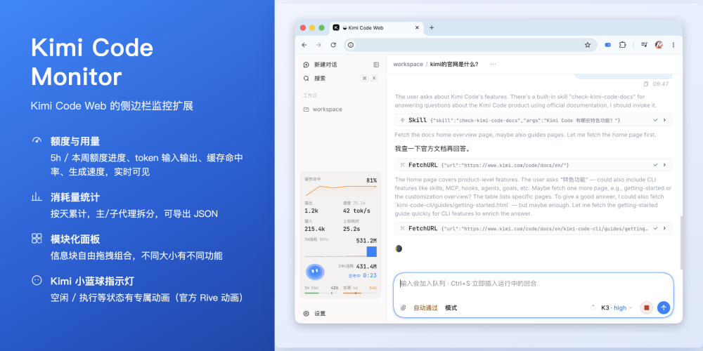
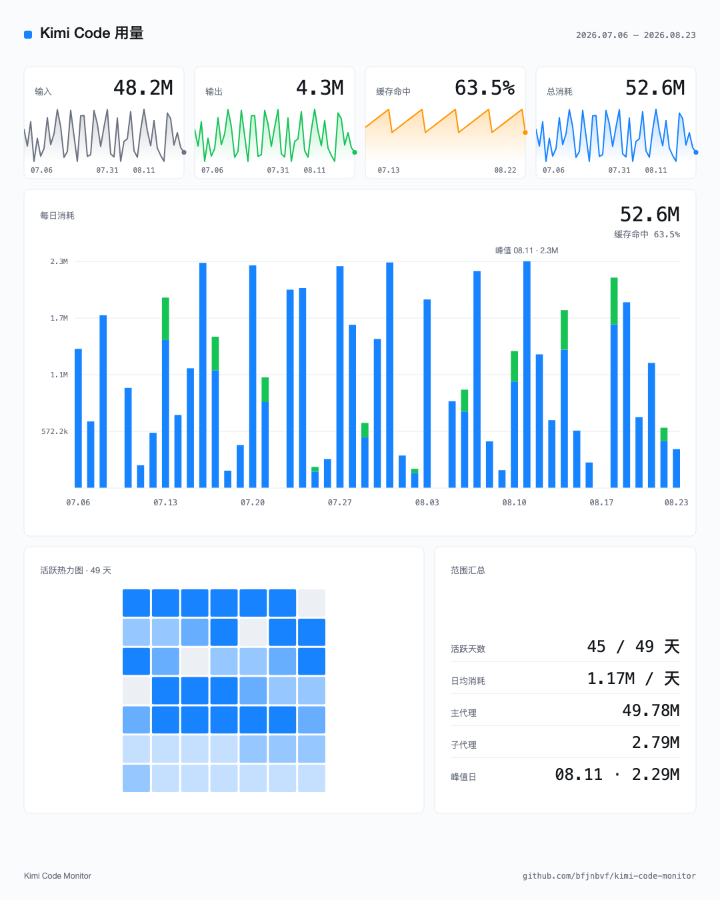

# Kimi Code Monitor

Kimi Code Web 的侧边栏监控扩展。一只会反映工作状态的吉祥物，一只兼容 Codex 画廊的桌面宠物，一套完整的用量分析与分享，一个随时回看的 AI 回复收藏夹——全部本地运行，数据不上传。

## 主要特性

### 通用 Codex 桌面宠物

在页面上养一只像素宠物。它会跟着你的工作节奏变换动作：你提问时它埋头干活，干完了示意你来看结果，出错或掉线时沮丧地低下头，平时安安静静待着。

- 完全兼容 Codex 官方宠物素材格式：打开弹窗，从宠物画廊（[codexpet.top](https://codexpet.top/zh)、[petdex.dev](https://petdex.dev)）复制一条安装命令、粘贴、点安装即可
- 可以同时收藏多只，一键切换；鼠标悬停打招呼、按住拖拽停放、靠近时转过脸看你（v2 素材）；大小 50%–150% 可调

### 用量分析

- **额度进度条**：5 小时与本周额度，附重置倒计时和一条匀速参照线——按时间均匀消耗此刻该到的位置，超过就是用得偏猛
- **消耗量**：连接本地 Kimi CLI 后按天统计本机 token 消耗（24h / 7 天 / 30 天），主/子代理堆叠展示
- **折线图**：统计模块拉成整宽后显示当前会话的逐轮变化曲线，悬停看每个点的数值
- **Popup 完整版**：按天消耗图表（自定义日期范围）、140 天活跃热力图、数据导出（不含对话内容）
- **额度预警**：5h / 本周额度超过 80% 和 95% 时桌面通知

### AI 回复收藏

看到值得留存的回答，点它底部操作行的星标即可收藏。

- 收藏的回复以**橙色目录行**进入右侧消息目录，点击即跳回原文
- 侧栏「收藏」入口打开整页收藏页：**列表 / 卡片双视图**、按会话分组与时间排序、批量管理（全选 / 删除所选）
- 点开任意一条弹出详情卡：上一轮用户提问 + Markdown 完整还原的回复全文 + 跳转原文按钮
- 支持跨会话跳转；收藏数据只存在本地

### 用量分享卡片

popup 消耗量板块点「生成分享图」，按当前选择的日期范围生成一张 1080×1350 分享卡片：四张统计卡（输入 / 输出 / 缓存命中 / 总消耗，各带渐变折线与关键日期标签）、每日消耗堆叠柱图（纵轴参照线）、活跃热力图、范围汇总（活跃天数 / 日均 / 主子代理 / 峰值日）。

支持下载 2x 高清 PNG，或直接复制到剪贴板。

### 会反映状态的吉祥物

面板里住着 Kimi 官方蓝色小球（与 kimi.com 对话页同款动画）。空闲时呼吸并显示当前时间；开始工作后变成加载动画并给本轮回答计时（调用工具不打断）；回答结束撒花庆祝；限流、子代理工作、掉线重连各有专属动作。点一下它，会随机做个小动作。

它右侧的状态文字区分「思考中」（模型生成）和「执行中」（工具调用），颜色随状态变化；数据位可在六种口径间切换：24h 消耗 / 输入 / 输出 / 缓存命中 / 速度 / 余额。

### 模块化自定义面板

面板的每个信息块都是独立模块，可以自由组合。模块大小也可以自由调整——不同大小呈现不同内容：半宽只保留核心数字，拉成整宽则会展开折线图、消耗量柱图等更多细节。

- **长按**进入编辑模式，把模块拖到三个区域：隐藏 / 仅完整模式显示 / Mini 保留
- 同一区域内拖动排序，半宽整宽混排（像磁贴一样）
- 每个模块的 ≡ 菜单里有它的专属设置

### 新会话 AI 自动命名

新会话聊到第 3 轮时，自动生成一个简短标题（可带 emoji）写回侧边栏，不再用首条消息原文凑数。手动改过的名字永远不会被覆盖。

用哪个模型由你挑：Kimi Code 内置模型，或你的 DeepSeek / Kimi API 账户——可选模型实时从服务商获取，永远是最新列表。弹窗里可随时开关，并查看命名累计消耗的 token。

### 中英文双语

全部界面文案（面板、弹窗、收藏、分享卡片）支持中文与 English，**跟随 Kimi Web 的语言设置**，切换后约 1 秒热更新，无需刷新页面。

### 更多

- 加油包余额显示，点击直达充值页（可改为控制台）
- 侧栏美化（可开关）：隐藏侧栏顶部 logo，新建对话按钮上移，与伸缩按钮排成一行

## 安装与授权

需要 Chrome 120 或更高版本。

**方式一（推荐）：下载构建好的 zip**

从 [Releases](https://github.com/bfjnbvf/kimi-code-monitor/releases) 下载最新的 `kimi-code-monitor-v*.zip`，解压后在 `chrome://extensions` 开启开发者模式，加载解压目录即可。

> 注意：GitHub 的「Code → Download ZIP」下载的是**源码包**（`kimi-code-monitor-main`），里面没有 `dist/` 产物，直接加载会报「无法为脚本加载 JavaScript dist/content.js」。不想自己构建的话请用 Releases 里的 zip。

**方式二：源码构建**

0. 首次使用先构建：`npm install && npm run build`（把 `src/` 打成 `dist/`；之后改了源码就再跑一次 `npm run build`）
1. 在 `chrome://extensions` 开启开发者模式，加载本目录（或解压 zip 后加载）
2. 打开 `kimi web` 启动的本地页面
3. 首次加载会显示新手引导；面板提示授权时点击完成一次设备授权
4. 如需24h、7天、30天长期统计，在消耗量模块或右上角 popup 点击“连接本地 CLI”，选择 sessions 目录：macOS / Linux 默认为 `~/.kimi-code/sessions`，Windows 默认为 `%USERPROFILE%\.kimi-code\sessions`

> `.kimi-code` 是隐藏目录。macOS 的目录选择器按 `⌘⇧.` 显示隐藏目录；Linux 通常按 `Ctrl+H`；Windows 可按 `Ctrl+L` 后粘贴上述路径。若配置过 `KIMI_CODE_HOME`，请选择其中的 `sessions` 目录。

> 在 `chrome://extensions` 重新加载扩展后，需要手动刷新一次 Kimi Code Web 页面，面板才会恢复。

扩展使用自己的 OAuth token，不读写 Kimi Code CLI 的凭据。CLI 目录授权仅用于可选的长期用量统计。

## 数据与隐私

- 默认不持久化 WebSocket 会话历史；输入、输出、缓存、速度和折线图只维护当前页面数据
- 未连接本地 CLI 时，24h、7天、30天长期统计保持锁定，其他实时功能不受影响
- 连接本地 CLI 后，只读取 `sessions/**/agents/*/wire.jsonl`，仅提取 `usage.record`；不保存或上传对话原文、工具参数和回答内容
- 输入 = 未缓存输入 + 缓存读取 + 缓存创建；缓存命中率 = 缓存读取 ÷ 总输入
- CLI 统计缓存只保存文件读取位置和最近90天的按天数字，可随时断开并清除后重新生成
- 收藏功能只保存在本地扩展存储（turnId + 内容摘录 + 渲染后片段，不含任何上传）；删除收藏或卸载扩展即清除
- 首次连接显示真实读取百分比；后续只增量读取新增记录，并限制自动刷新频率
- 额度与缓存命中率统一显示一位小数；真实值不足100%时不会提前显示为100.0%

## 项目结构

源码在 `src/`（ES modules），`npm run build` 用 esbuild 打出 `dist/`（content/background/popup 三个 bundle），manifest 与 popup.html 只引用 `dist/` 产物。`npm test` 先构建再跑全部测试，`npm run lint` 做引用检查（no-undef 等）。

三个运行面各自一个目录，共享模块在 `src/` 根部：

- `src/content.js` + `src/content/`：页面内面板——`content.js`（编排入口与生命周期）、`panel-state.js`（共享状态容器）、`render.js`（渲染层）、`widget-structure.js`（DOM 结构与编辑模式）、`websocket-session.js`（WS 状态机）、`session.js`（会话与快照）、`quota.js`（额度与授权）、`usage-daily.js`（CLI 长期统计与外部账户）、`pet-panel.js`（Rive 吉祥物与桌面宠物驱动）、`bookmarks.js`（AI 回复收藏：星标、目录交错行、收藏页与详情弹层、跨会话跳转）、`utils.js` / `walkthrough.js`
- `src/background/`：后台域模块——`store.js`（存储锁/fetch/中转）、`vault.js`（密钥库）、`oauth.js`（授权与账户）、`quota.js`（额度/预警/快照）、`external.js`（外部 provider）、`rename.js`（会话命名）、`pet.js`、`cli-scan.js`；`src/background.js` 是消息路由入口
- `src/popup/`：弹窗板块——`shared.js`、`usage.js`、`accounts.js`、`external.js`、`rename.js`、`pets.js`、`share-card.js`（分享卡片取数/预览/导出）；`src/popup.js` 是装配入口，样式在 `popup.css`
- `src/share-card.js`：分享卡片构图（纯函数，输入按天数据输出 SVG）
- `src/i18n.js`：中英文案（gettext 风格，跟随 Kimi Web 语言设置）
- `src/metrics.js`：共享纯函数（用量解析、日期汇总、配置归一化）
- `src/cli-usage.js`：本地 CLI 目录授权、增量读取和按天汇总
- `src/providers.js`：外部 provider 的端点与解析
- `src/pet/`：桌面宠物——`pet-sprites.js`（图集播放器 + 行为）、`pet-install.js`（画廊命令解析与下载）、`pet-store.js`（IndexedDB 素材库）
- `src/session-rename/`：新会话 AI 自动命名（模型调用、命名策略与共享工具）
- `rive/`：吉祥物动画运行时与资产（本地打包，无远程依赖）
- `web-token.js`：已停用的网页端 token 中继（保留备用，未在 manifest 注册）
