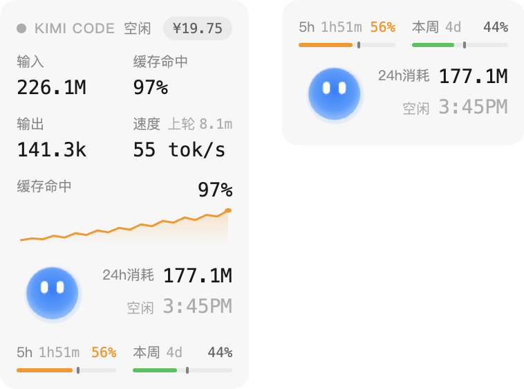
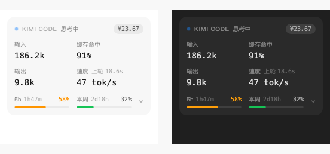
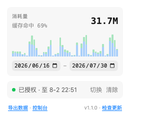

# Kimi Code Monitor

在本地 Kimi Code Web 侧边栏显示当前会话的 token、缓存命中率、生成速度、耗时、额度和加油包余额；popup 提供按天的消耗量统计、主/子代理拆分和数据导出。

更多截图：Mini 模式 / 新手引导 / 消耗量弹窗

## 功能

**侧边栏状态面板**

- 状态灯：灰 = 空闲，蓝 = 工作中，红 = 未授权或未连接
- 输入 / 输出 / 缓存命中 / 速度（最近 5 个有效步骤的中位速度，忽略计时过短的异常样本）+ 上轮耗时
- 5 小时与本周额度进度条，标签旁显示距重置的剩余时间
- 加油包余额，点击直达充值页
- 点击标题手动刷新；点击额度行切换 Mini 模式（选择会被记住）
- 宽度不足时各模块自动降级（标题缩短、倒计时隐藏、「上轮」隐藏）

**popup 消耗量**

- 按天累计 token 消耗，任意日期范围查看（默认今日），柱状图随范围联动
- 主代理 / 子代理堆叠双色展示，悬停查看单日拆分
- 缓存命中率随范围实时计算
- 「导出数据」下载按天累计的 JSON
- 「控制台」直达 Kimi Code Console，「检查更新」直达 GitHub Releases

**额度预警**

- 5 小时 / 本周额度越过 80% 与 95% 时发送桌面通知，点击通知打开控制台
- 每个窗口、每个阈值只提醒一次，窗口重置后重新武装
- 仅在页面活跃拉取额度时顺带评估，无后台轮询、零额外功耗

## 首次使用

需要 Chrome 120 或更高版本。

1. 在 `chrome://extensions` 开启开发者模式，加载本目录。
2. 打开 `kimi web` 启动的本地页面。
3. 首次加载会显示一次新手引导；状态栏显示「授权」时，点击状态栏并在 Kimi 页面完成一次设备授权。

> 注意：在 `chrome://extensions` 重新加载扩展后，Chrome 不会把 content script 重新注入已打开的页面，需要手动刷新一次 Kimi Code Web 页面，状态栏才会恢复工作。

扩展使用自己的 OAuth token，不读写 Kimi Code CLI 的凭据，避免 refresh token 轮换导致 CLI 掉线。

## 授权管理

- 首次使用：状态栏显示「授权」时点击状态栏，在打开的 Kimi 页面完成一次设备授权；授权成功后授权页会自动关闭。
- 重新授权 / 切换账户 / 清除授权：点击浏览器工具栏的扩展图标，在弹窗底部的状态行操作。

## 数据口径

- 消耗量统计从扩展安装后开始累计，仅覆盖通过本扩展观察到的 Kimi Code Web 会话（不含 CLI 与其他设备）。
- 输入 = 未缓存输入 + 缓存读取 + 缓存创建；缓存命中率 = 缓存读取 ÷ 总输入。
- 主/子代理拆分依据 WS 事件的 `agentId` 字段；事件不携带模型信息，因此不区分模型供应商。
- 数据保存在本地 `chrome.storage.local`，保留最近 90 天，不会上传。

## 架构

- `metrics.js`：统一解析 token 字段，计算总输入、缓存占比、稳健生成速度，以及按天累计 / 范围聚合的纯函数。
- `content.js`：读取本地 server credential，初始化会话用量，订阅 WebSocket 事件并更新 UI；处理 `resync_required` 重同步；将每条 step 用量上报 background。
- `background.js`：执行 Kimi Device OAuth、自动刷新 token、请求跨域额度 API；按 `sessionId + seq` 去重后把用量按天落盘（写入串行化）；评估额度阈值并发送通知。
- `popup.html` / `popup.js`：工具栏弹窗（兼作扩展选项页），承载消耗量图表、日期范围、导出与授权管理。
- `content.css`：侧边栏状态组件与新手引导样式。

WebSocket 订阅会先读取会话 `last_seq`，再只消费后续事件，避免断线重连后重复累计；background 侧对每条用量事件再做一次 `sessionId + seq` 去重，同一会话开多个标签页不会重复计数。

## 推荐

本扩展仅适用于 Kimi Code Web 页面；如果你想要一个更全面的、常驻菜单栏的监控面板，推荐这位大佬的作品：[KimiCodeBar](https://github.com/xifandev/KimiCodeBar)。
