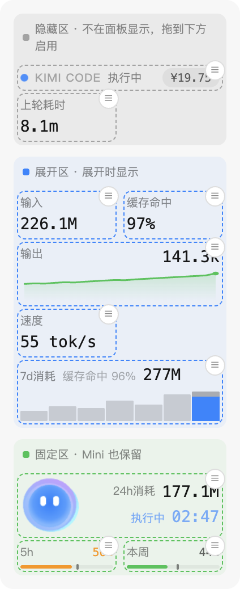
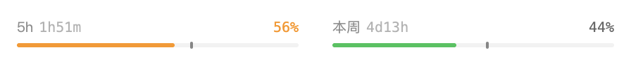
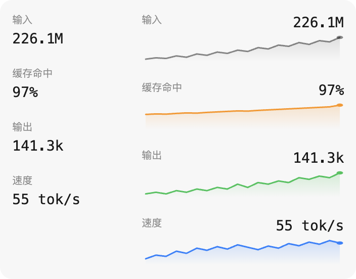

# Kimi Code Monitor

Kimi Code Web 的侧边栏监控扩展。一只会反映工作状态的吉祥物，一块可以自由拼装的模块化面板：额度、token、缓存、速度、消耗量，全部本地运行，数据不上传。

## 主要特性

### 会反映状态的吉祥物

面板里住着 Kimi 官方蓝色小球（与 kimi.com 对话页同款动画）。它空闲时呼吸并显示当前时间；开始工作后变成加载动画并给本轮回答计时（调用工具不打断）；回答结束撒花庆祝；限流、子代理工作、掉线重连各有专属动作。点一下它，会随机做个小动作。

它右侧的状态文字区分「思考中」（模型生成）和「执行中」（工具调用），颜色随状态变化；数据位可在六种口径间切换：24h 消耗 / 输入 / 输出 / 缓存命中 / 速度 / 余额。

### 模块化自定义面板

面板的每个信息块都是独立模块，可以自由组合。模块大小也可以自由调整——不同大小呈现不同内容：半宽只保留核心数字，拉成整宽则会展开折线图、消耗量柱图等更多细节。

- **长按**进入编辑模式，把模块拖到三个区域：隐藏 / 仅完整模式显示 / Mini 保留
- 同一区域内拖动排序，半宽整宽混排（像磁贴一样）
- 每个模块的 ≡ 菜单里有它的专属设置
- Mini 模式显示什么完全由底部区域的模块决定，点底部区域随时收起展开

### 额度与用量统计

- **额度进度条**：5 小时与本周额度，附重置倒计时和一条灰色参照线——按时间均匀消耗的话此刻该用到的位置，超过它就是用得偏猛

- **消耗量**：按天统计 token 消耗（24h / 7 天 / 30 天），区分主代理与子代理
- **折线图**：统计模块拉成整宽后显示当前会话的逐轮变化曲线，悬停看每个点的数值

- **数据导出**：全部用量历史存在本地，可随时导出 JSON 存档（含逐轮明细和每日额度快照）

### 侧栏美化（可开关）

隐藏侧栏顶部的 logo，新建对话按钮上移，与伸缩按钮排成一行。不喜欢可在宠物 ≡ 菜单里关闭。

### 更多

- 加油包余额显示，点击直达充值页（可改为控制台）
- 5h / 本周额度超过 80% 和 95% 时桌面通知
- 弹窗提供完整版按天消耗图表（自定义日期范围）和数据导出

## 安装与授权

需要 Chrome 120 或更高版本。

1. 在 `chrome://extensions` 开启开发者模式，加载本目录（或解压 zip 后加载）
2. 打开 `kimi web` 启动的本地页面
3. 首次加载会显示新手引导；面板提示授权时点击完成一次设备授权

> 在 `chrome://extensions` 重新加载扩展后，需要手动刷新一次 Kimi Code Web 页面，面板才会恢复。

扩展使用自己的 OAuth token，不读写 Kimi Code CLI 的凭据。

## 数据与隐私

- 全部数据保存在浏览器本地，不上传
- 输入 = 未缓存输入 + 缓存读取 + 缓存创建；缓存命中率 = 缓存读取 ÷ 总输入
- 按天累计保留最近 90 天；逐轮明细在存档超过 6MB 时按最旧会话自动清理
- 仅统计通过本扩展观察到的 Kimi Code Web 会话，不含 CLI 与其他设备

## 项目结构

- `content.js`：面板注入、WebSocket 订阅、模块渲染与交互、宠物驱动
- `walkthrough.js`：首次加载的分步新手引导（高亮目标 + 气泡说明）
- `background.js`：OAuth、额度 API、用量持久化、额度预警
- `metrics.js`：共享纯函数（用量解析、配置归一化、存档管理）
- `popup.html / popup.js`：工具栏弹窗（授权管理、完整版消耗量、导出、重置布局）
- `rive/`：吉祥物动画运行时与资产（本地打包，无远程依赖）
